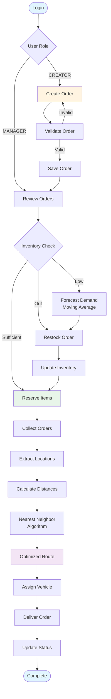

## 🏭 Smart Warehouse Management System

A full-stack Smart Warehouse Management System designed to simulate real-world warehouse operations including order lifecycle management, inventory control, route optimization, and sales forecasting, with role-based access control.

This project demonstrates backend system design, data consistency, and practical algorithm usage in a logistics context.

## 🚀 Features

### 🔐 Authentication & Authorization
- User registration and login
- JWT-based authentication
- Role-based access control (Admin, Warehouse Manager, Order Creator)

### 📦 Inventory Management
- Real-time inventory tracking
- Inventory forecasting
- Restock management
- Stock level monitoring

### 📋 Order Management
- Create and manage orders
- Order tracking and status updates
- Order history

### 🗺️ Route Optimization
- Optimized delivery routes
- Distance calculations between cities
- Efficient route planning

### 📊 Analytics & Forecasting
- Inventory forecasting
- Data visualization with charts
- Sales data analysis

### 👥 User Roles

1. **Admin**
   - Full system access
   - User management
   - System configuration

2. **Warehouse Manager**
   - Order management
   - Route optimization
   - Inventory forecasting
   - Restock management

3. **Order Creator**
   - Create new orders
   - View order history
   - Dashboard overview
  
## 🌐 Deployment

The application is deployed and accessible at:

**Live Application:** []()

---

## 📊 Workflow Charts


### Complete Order-to-Delivery Workflow



 ## 🛠️ Tech Stack

### Frontend
- **React** - UI framework
- **React Router** - Routing
- **React Bootstrap** - UI components
- **Axios** - HTTP client

### Backend
- **Node.js** - Runtime environment
- **Express 5** - Web framework
- **PostgreSQL** - Database
- **JWT** - Authentication
- **bcryptjs** - Password hashing

### Algorithm Used
- **Nearest Neighbor** - Route optimization
- **Moving Average** - Sales forecasting

## Project Structure

```
Smart_Warehouse_Management_System/
├── WAREHOUSING PROJECT/
│   ├── backend/
│   │   ├── src/
│   │   │   ├── app.js              # Express app configuration
│   │   │   ├── server.js           # Server entry point
│   │   │   ├── config/
│   │   │   │   └── db.js           # Database configuration
│   │   │   ├── controllers/        # Request handlers
│   │   │   ├── middleware/         # Auth middleware
│   │   │   ├── routes/             # API routes
│   │   │   └── utils/              # Utility functions
│   │   └── package.json
│   ├── frontend/
│   │   ├── src/
│   │   │   ├── App.jsx             # Main app component
│   │   │   ├── api/                # API client configuration
│   │   │   ├── auth/               # Authentication components
│   │   │   ├── components/         # Reusable components
│   │   │   ├── pages/              # Page components
│   │   │   │   ├── admin/          # Admin pages
│   │   │   │   ├── creator/        # Order creator pages
│   │   │   │   └── manager/        # Manager pages
│   │   │   └── utils/              # Utility functions
│   │   └── package.json
│   └── data/
│       ├── raw/                    # Raw data files
│       ├── cleaned/                # Processed data files
│       └── data_preprocess/        # Data preprocessing scripts
└── README.md
```

## Prerequisites

Before you begin, ensure you have the following installed:
- **Node.js** (v18 or higher)
- **npm**
- **PostgreSQL** (v12 or higher)


## Installation

### 1. Clone the repository

```bash
git clone <repository-url>
cd Smart_Warehouse_Management_System
```

### 2. Database Setup

1. Create a PostgreSQL database:
```sql
CREATE DATABASE warehouse_db;
```

2. Update the database configuration in `WAREHOUSING PROJECT/backend/src/config/db.js` with your PostgreSQL credentials:
```javascript
const pool = new Pool({
  host: 'localhost',
  port: 5432,
  user: 'your_username',
  password: 'your_password',
  database: 'warehouse_db',
  options: '-c search_path=your_schema'
});
```

3. Create the necessary tables with the following structure:

- **users**: `[id, name, email, password, role, is_active, created_at]`
- **products**: `[product_name]`
- **locations**: `[id, name, latitude, longitude]`
- **warehouses**: `[id, name, location_id]`
- **inventory**: `[product_name, warehouse_id, quantity]`
- **orders**: `[id, warehouse_id, delivery_city, status, user_id, created_at]`
- **order_items**: `[id, order_id, product_name, quantity]`
- **sales_records**: `[id, product_name, quantity_sold, date]`

### 3. Backend Setup

```bash
cd "WAREHOUSING PROJECT/backend"
npm install
```

Create a `.env` file in the backend directory (if needed):
```env
PORT=3000
JWT_SECRET=your_jwt_secret_key
DB_HOST=localhost
DB_PORT=5432
DB_USER=your_username
DB_PASSWORD=your_password
DB_NAME=warehouse_db
```

### 4. Frontend Setup

```bash
cd "../frontend"
npm install
```

## Running the Application

### Start the Backend Server

```bash
cd "WAREHOUSING PROJECT/backend"
node src/server.js
```

The backend server will run on `http://localhost:3000`

### Start the Frontend Development Server

```bash
cd "WAREHOUSING PROJECT/frontend"
npm run dev
```

The frontend will be available at `http://localhost:5174` (or the port shown in the terminal)

## API Endpoints

### Authentication
- `POST /auth/register` - Register a new user
- `POST /auth/login` - User login

### Inventory
- `GET /inventory` - Get inventory items
- `POST /inventory` - Add inventory item
- `PUT /inventory/:id` - Update inventory item
- `DELETE /inventory/:id` - Delete inventory item

### Orders
- `GET /orders` - Get all orders
- `POST /orders` - Create new order
- `PUT /orders/:id` - Update order
- `DELETE /orders/:id` - Delete order

### Routes
- `GET /routes` - Get optimized routes
- `POST /routes/optimize` - Optimize delivery routes

### Admin
- `GET /admin/users` - Get all users
- `POST /admin/users` - Create user
- `PUT /admin/users/:id` - Update user
- `DELETE /admin/users/:id` - Delete user

## Data Preprocessing

The project includes data preprocessing scripts for agriculture sales and Indian cities data:

```bash
cd "WAREHOUSING PROJECT/data/data_preprocess"
python clean_agriculture_sales.py
python clean_cities.py
```

## Development

### Backend Scripts
```bash
npm test  # Run tests (when implemented)
```

### Frontend Scripts
```bash
npm run dev      # Start development server
npm run build    # Build for production
npm run preview  # Preview production build
npm run lint     # Run ESLint
```

---

