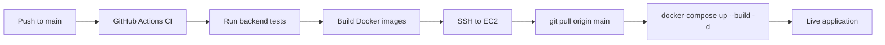
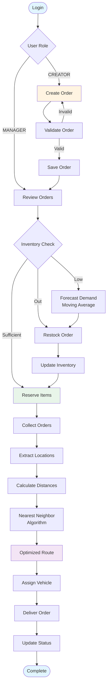

## 🏭 Smart Warehouse Management System

A full-stack Smart Warehouse Management System designed to simulate real-world warehouse operations including order lifecycle management, inventory control, route optimization, and sales forecasting, with role-based access control.

This project demonstrates backend system design, data consistency, practical algorithm usage in a logistics context, and production deployment with Docker, CI/CD, and cloud hosting.

[](https://github.com/04Htrap/Smart_Warehouse_Management_System/actions/workflows/ci.yml)

## 🚀 Features

### 🔐 Authentication & Authorization
- User registration and login
- JWT-based authentication
- Role-based access control (Admin, Warehouse Manager, Order Creator)

### 📦 Inventory Management
- Real-time inventory tracking
- Inventory forecasting
- Restock management
- Stock level monitoring

### 📋 Order Management
- Create and manage orders
- Order tracking and status updates
- Order history

### 🗺️ Route Optimization
- Optimized delivery routes
- Distance calculations between cities
- Efficient route planning

### 📊 Analytics & Forecasting
- Inventory forecasting
- Data visualization with charts
- Sales data analysis

### 👥 User Roles

1. **Admin**
   - Full system access
   - User management
   - System configuration

2. **Warehouse Manager**
   - Order management
   - Route optimization
   - Inventory forecasting
   - Restock management

3. **Order Creator**
   - Create new orders
   - View order history
   - Dashboard overview

## 🌐 Deployment

The application is hosted on **AWS EC2** and deployed automatically via **GitHub Actions** on every push to `main`.

| Service  | URL |
|----------|-----|
| Frontend | http://13.60.166.142:5174 |
| Backend API | http://13.60.166.142:3000 |

**Repository:** [github.com/04Htrap/Smart_Warehouse_Management_System](https://github.com/04Htrap/Smart_Warehouse_Management_System)

---

## 🔄 CI/CD Pipeline

The project uses a GitHub Actions workflow (`.github/workflows/ci.yml`) that runs on pushes to `main` and can also be triggered manually.

### Pipeline steps

1. **Checkout** the repository
2. **Backend** — install dependencies, run Jest tests, build Docker image
3. **Frontend** — install dependencies, build Docker image
4. **Deploy to EC2** — SSH into the server, pull latest code, and restart containers with Docker Compose

### Required GitHub secrets

Configure these under **Settings → Secrets and variables → Actions**:

| Secret | Description |
|--------|-------------|
| `EC2_HOST` | Public IP or hostname of the EC2 instance |
| `EC2_USER` | SSH username (e.g. `ubuntu`) |
| `EC2_KEY` | Private SSH key for the EC2 instance |

### Deployment flow


```mermaid
flowchart LR
    Push[Push to main] --> CI[GitHub Actions CI]
    CI --> Test[Run backend tests]
    Test --> Build[Build Docker images]
    Build --> SSH[SSH to EC2]
    SSH --> Pull[git pull origin main]
    Pull --> Compose[docker-compose up --build -d]
    Compose --> Live[Live application]
```

---


## 📊 Workflow Charts

### Complete Order-to-Delivery Workflow


```mermaid
flowchart TB
    Start([Login]) --> Role{User Role}
    Role -->|CREATOR| Create[Create Order]
    Role -->|MANAGER| Review[Review Orders]
    
    Create --> Validate[Validate Order]
    Validate -->|Invalid| Create
    Validate -->|Valid| Save[Save Order]
    
    Save --> Review
    Review --> Check{Inventory Check}
    
    Check -->|Sufficient| Reserve[Reserve Items]
    Check -->|Low| Forecast[Forecast Demand<br/>Moving Average]
    Check -->|Out| Restock[Restock Order]
    
    Forecast --> Restock
    Restock --> Update[Update Inventory]
    Update --> Reserve
    
    Reserve --> Collect[Collect Orders]
    Collect --> Extract[Extract Locations]
    Extract --> Calculate[Calculate Distances]
    Calculate --> Optimize[Nearest Neighbor<br/>Algorithm]
    Optimize --> Route[Optimized Route]
    Route --> Assign[Assign Vehicle]
    
    Assign --> Deliver[Deliver Order]
    Deliver --> UpdateStatus[Update Status]
    UpdateStatus --> Complete([Complete])
    
    style Start fill:#e1f5ff
    style Create fill:#fff4e1
    style Reserve fill:#e8f5e9
    style Route fill:#f3e5f5
    style Complete fill:#e1f5ff
```

## 🛠️ Tech Stack

### Frontend
- **React** — UI framework
- **React Router** — Routing
- **React Bootstrap** — UI components
- **Axios** — HTTP client
- **Vite** — Build tool

### Backend
- **Node.js** — Runtime environment
- **Express 5** — Web framework
- **PostgreSQL** — Database
- **JWT** — Authentication
- **bcrypt** — Password hashing

### DevOps & Infrastructure
- **Docker** — Containerization
- **Docker Compose** — Multi-container orchestration
- **GitHub Actions** — CI/CD pipeline
- **AWS EC2** — Cloud hosting

### Algorithms
- **Nearest Neighbor** — Route optimization
- **Moving Average** — Sales forecasting

## Project Structure

```
Smart_Warehouse_Management_System/
├── .github/
│   └── workflows/
│       └── ci.yml                  # CI/CD pipeline
├── WAREHOUSING PROJECT/
│   ├── docker-compose.yml          # Orchestrates db, backend, frontend
│   ├── backend/
│   │   ├── dockerfile
│   │   ├── init/
│   │   │   └── schema.sql          # Database schema & seed data
│   │   ├── tests/
│   │   │   └── auth.test.js        # Backend tests
│   │   ├── src/
│   │   │   ├── app.js              # Express app configuration
│   │   │   ├── server.js           # Server entry point
│   │   │   ├── config/
│   │   │   │   └── db.js           # Database configuration
│   │   │   ├── controllers/        # Request handlers
│   │   │   ├── middleware/         # Auth middleware
│   │   │   ├── routes/             # API routes
│   │   │   └── utils/              # Utility functions
│   │   └── package.json
│   ├── frontend/
│   │   ├── Dockerfile
│   │   ├── src/
│   │   │   ├── App.jsx             # Main app component
│   │   │   ├── api/                # API client configuration
│   │   │   ├── auth/               # Authentication components
│   │   │   ├── components/         # Reusable components
│   │   │   ├── pages/              # Page components
│   │   │   │   ├── admin/          # Admin pages
│   │   │   │   ├── creator/        # Order creator pages
│   │   │   │   └── manager/        # Manager pages
│   │   │   └── utils/              # Utility functions
│   │   └── package.json
│   └── data/
│       ├── raw/                    # Raw data files
│       ├── cleaned/                # Processed data files
│       └── data_preprocess/        # Data preprocessing scripts
└── README.md
```

## Prerequisites

Before you begin, ensure you have the following installed:

- **Node.js** (v18 or higher)
- **npm**
- **Docker** and **Docker Compose** (recommended)
- **PostgreSQL** (v12 or higher) — only needed for manual/local setup without Docker

## Installation

### 1. Clone the repository

```bash
git clone https://github.com/04Htrap/Smart_Warehouse_Management_System.git
cd Smart_Warehouse_Management_System
```

### 2. Run with Docker (recommended)

From the `WAREHOUSING PROJECT` directory:

```bash
cd "WAREHOUSING PROJECT"
docker-compose up --build
```

This starts three services:

| Service | Port | Description |
|---------|------|-------------|
| `db` | 5432 | PostgreSQL 14 with schema loaded from `backend/init/schema.sql` |
| `backend` | 3000 | Node.js API server |
| `frontend` | 5174 | React app served via `serve` |

- Frontend: http://localhost:5174
- Backend API: http://localhost:3000

To run in the background:

```bash
docker-compose up --build -d
```

To stop:

```bash
docker-compose down
```

### 3. Manual setup (without Docker)

#### Database setup

1. Create a PostgreSQL database:

```sql
CREATE DATABASE warehouse_db;
```

2. Update the database configuration in `WAREHOUSING PROJECT/backend/src/config/db.js` with your PostgreSQL credentials.

3. Apply the schema from `WAREHOUSING PROJECT/backend/init/schema.sql`.

#### Backend setup

```bash
cd "WAREHOUSING PROJECT/backend"
npm install
```

Create a `.env` file in the backend directory:

```env
PORT=3000
JWT_SECRET=your_jwt_secret_key
DB_HOST=localhost
DB_PORT=5432
DB_USER=your_username
DB_PASSWORD=your_password
DB_NAME=warehouse_db
```

#### Frontend setup

```bash
cd "../frontend"
npm install
```

Optional: set the API URL in a `.env` file:

```env
VITE_API_URL=http://localhost:3000
```

## Running the Application

### With Docker

```bash
cd "WAREHOUSING PROJECT"
docker-compose up --build
```

### Without Docker

**Backend:**

```bash
cd "WAREHOUSING PROJECT/backend"
npm start
```

The backend server runs on http://localhost:3000

**Frontend:**

```bash
cd "WAREHOUSING PROJECT/frontend"
npm run dev
```

The frontend is available at http://localhost:5174 (or the port shown in the terminal)

## API Endpoints

### Authentication
- `POST /auth/register` — Register a new user
- `POST /auth/login` — User login

### Inventory
- `GET /inventory` — Get inventory items
- `POST /inventory` — Add inventory item
- `PUT /inventory/:id` — Update inventory item
- `DELETE /inventory/:id` — Delete inventory item

### Orders
- `GET /orders` — Get all orders
- `POST /orders` — Create new order
- `PUT /orders/:id` — Update order
- `DELETE /orders/:id` — Delete order

### Routes
- `GET /routes` — Get optimized routes
- `POST /routes/optimize` — Optimize delivery routes

### Admin
- `GET /admin/users` — Get all users
- `POST /admin/users` — Create user
- `PUT /admin/users/:id` — Update user
- `DELETE /admin/users/:id` — Delete user

## Data Preprocessing

The project includes data preprocessing scripts for agriculture sales and Indian cities data:

```bash
cd "WAREHOUSING PROJECT/data/data_preprocess"
python clean_agriculture_sales.py
python clean_cities.py
```

## Development

### Backend scripts

```bash
cd "WAREHOUSING PROJECT/backend"
npm test    # Run Jest tests
npm start   # Start the server
```

### Frontend scripts

```bash
cd "WAREHOUSING PROJECT/frontend"
npm run dev      # Start development server
npm run build    # Build for production
npm run preview  # Preview production build
npm run lint     # Run ESLint
```

---
